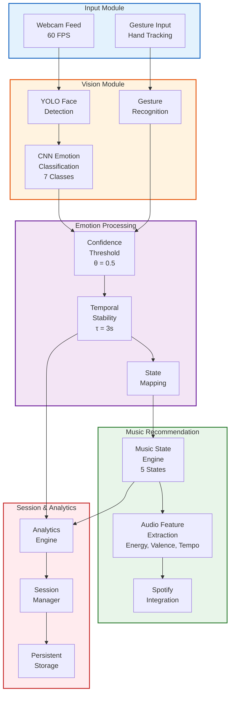
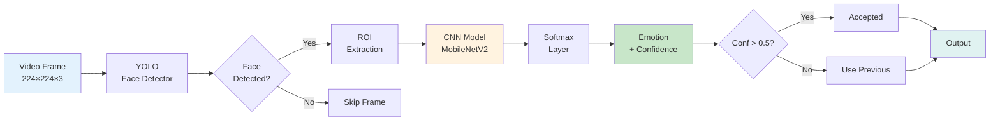
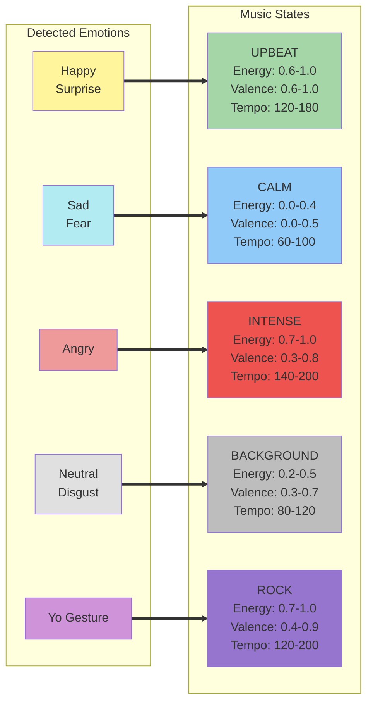
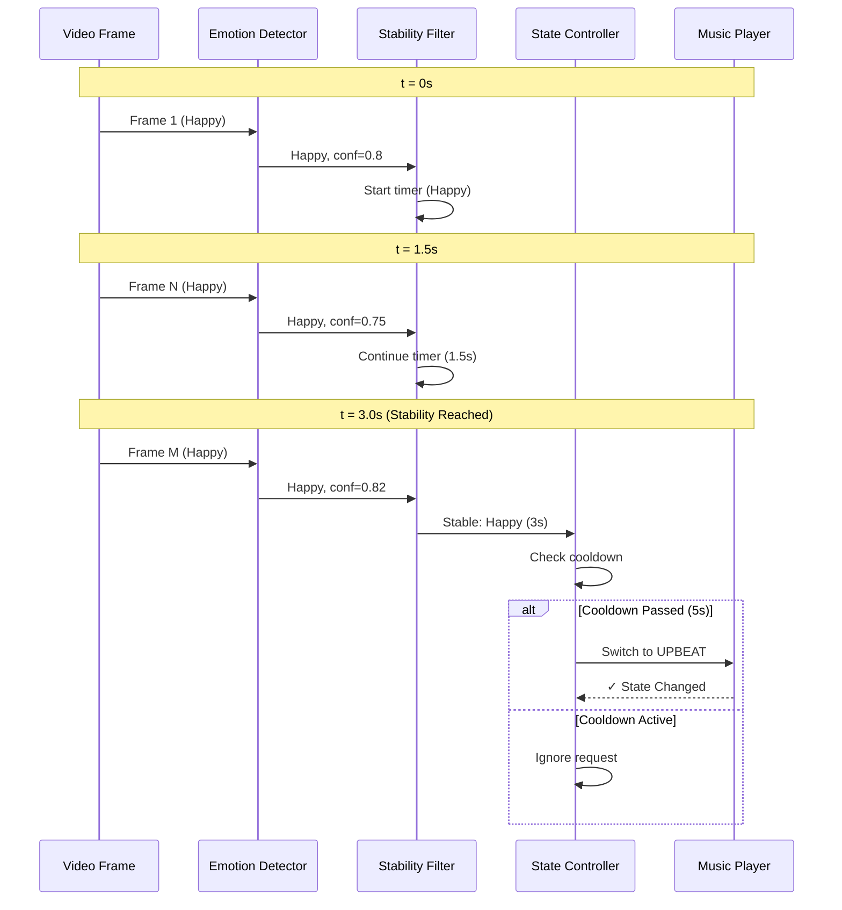
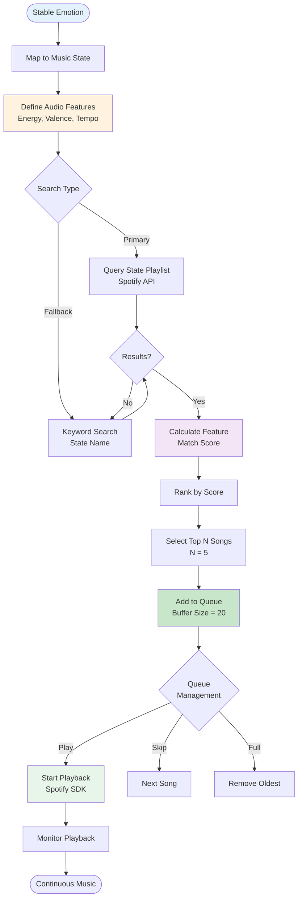
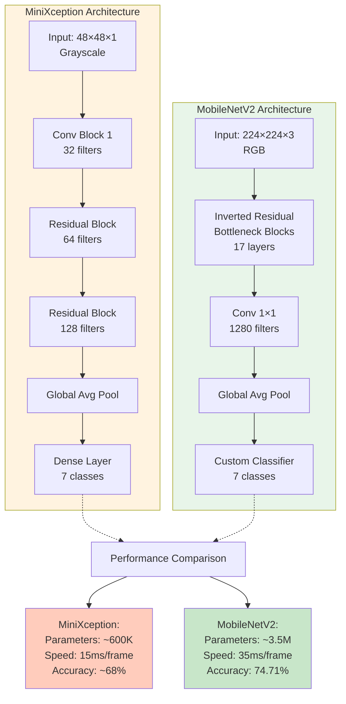
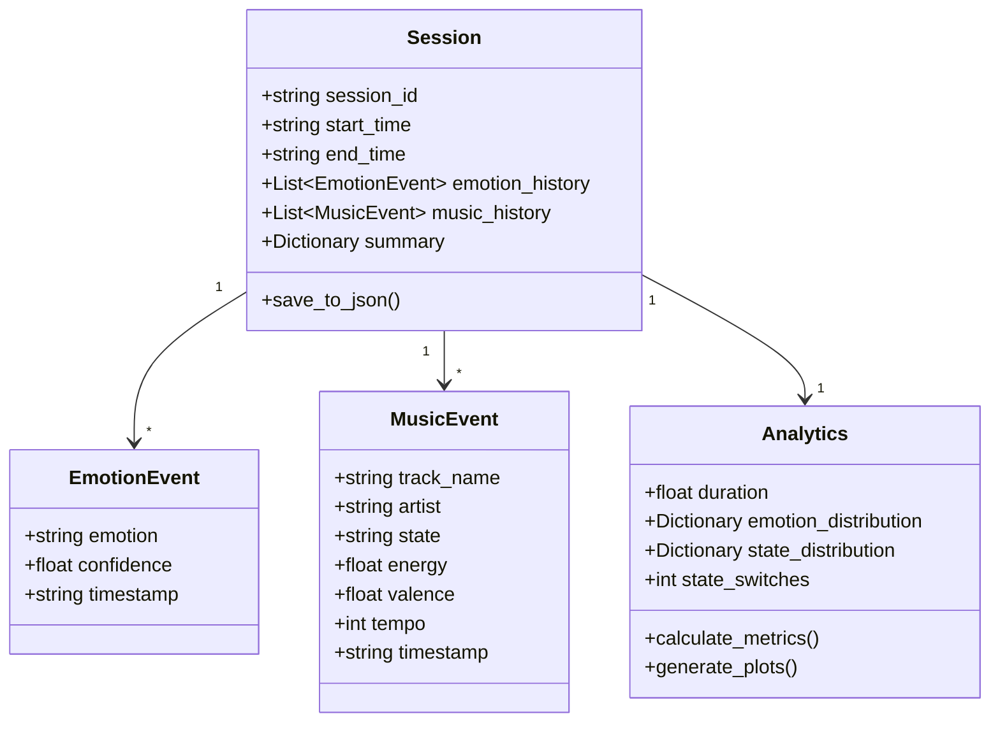
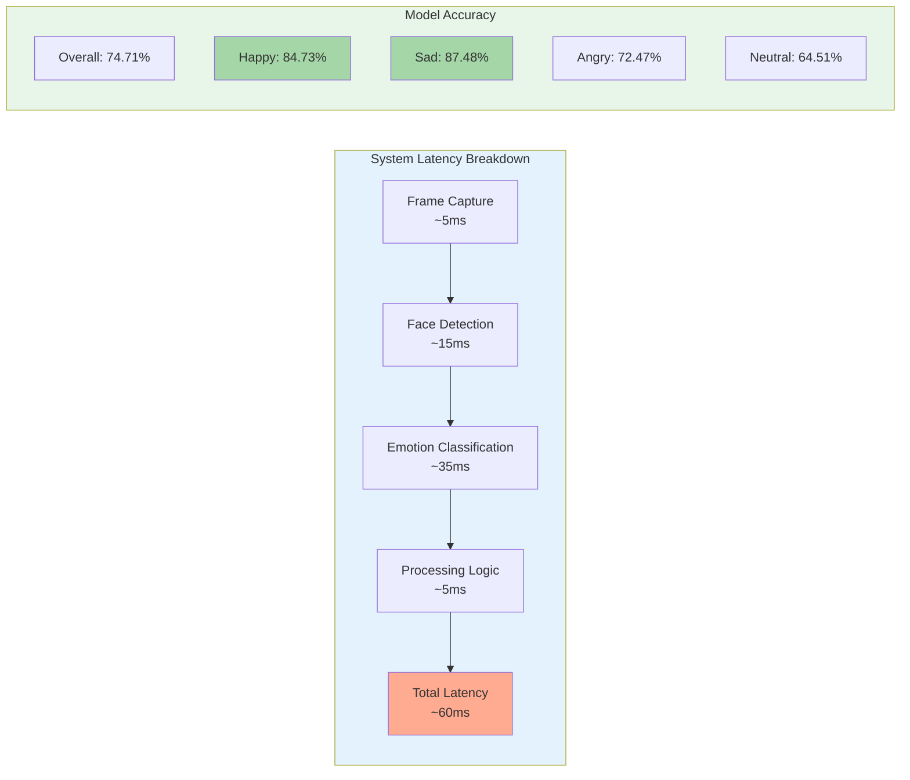

# Architecture Diagrams for Research Paper

This document contains publication-ready diagrams suitable for inclusion in academic research papers.

---

## Figure 1: High-Level System Architecture



**Caption**: *System architecture showing the five main modules: (1) Input acquisition, (2) Computer vision processing, (3) Emotion processing with temporal stability, (4) Music recommendation engine, and (5) Session management and analytics.*

---

## Figure 2: Emotion Detection Pipeline



**Caption**: *Emotion detection pipeline showing frame preprocessing, face detection using YOLO, emotion classification using MobileNetV2 CNN, and confidence-based filtering (θ = 0.5).*

---

## Figure 3: Emotion-to-Music State Mapping



**Caption**: *Mapping between detected emotions and music states with corresponding audio feature ranges. Each music state defines target ranges for energy, valence, and tempo used in Spotify API queries.*

---

## Figure 4: Temporal Stability Mechanism



**Caption**: *Temporal stability mechanism showing how emotions must remain consistent for τ = 3 seconds before triggering a music state change. State transitions also respect a cooldown period of 5 seconds to prevent frequent disruptions.*

---

## Figure 5: Music Recommendation Algorithm Flow



**Caption**: *Music recommendation algorithm flow showing playlist-based search with keyword fallback, audio feature matching, scoring, and dynamic queue management with a buffer size of 20 songs.*

---

## Figure 6: Model Architecture Comparison



**Caption**: *Comparison of two CNN architectures used for emotion classification. MiniXception offers faster inference suitable for resource-constrained environments, while MobileNetV2 provides higher accuracy with acceptable latency for real-time processing.*

---

## Figure 7: Session Analytics Data Structure



**Caption**: *UML class diagram showing the session data structure. Each session records emotion events with confidence scores, music playback events with audio features, and aggregated analytics for post-session analysis.*

---

## Figure 8: System Performance Metrics



**Caption**: *System performance metrics showing (left) latency breakdown for the emotion detection pipeline achieving real-time processing at ~60ms per frame, and (right) per-class accuracy from the MobileNetV2 model trained on AffectNet dataset.*

---

## Table 1: Emotion Classification Performance

| Emotion | Precision | Recall | F1-Score | Support |
|---------|-----------|--------|----------|---------|
| Angry | 0.6880 | 0.7247 | 0.7059 | 712 |
| Disgust | 0.6946 | 0.7767 | 0.7334 | 618 |
| Fear | 0.7006 | 0.6756 | 0.6879 | 672 |
| **Happy** | **0.8597** | **0.8473** | **0.8534** | 622 |
| **Sad** | **0.8793** | **0.8748** | **0.8771** | 791 |
| Surprise | 0.6777 | 0.6381 | 0.6573 | 514 |
| Neutral | 0.6959 | 0.6451 | 0.6695 | 603 |
| **Overall** | **0.7476** | **0.7471** | **0.7467** | **4532** |

---

## Table 2: Music State Audio Feature Ranges

| Music State | Energy | Valence | Tempo (BPM) | Typical Emotions |
|-------------|--------|---------|-------------|------------------|
| CALM | 0.0 - 0.4 | 0.0 - 0.5 | 60 - 100 | Sad, Fear |
| BACKGROUND | 0.2 - 0.5 | 0.3 - 0.7 | 80 - 120 | Neutral, Disgust |
| UPBEAT | 0.6 - 1.0 | 0.6 - 1.0 | 120 - 180 | Happy, Surprise |
| INTENSE | 0.7 - 1.0 | 0.3 - 0.8 | 140 - 200 | Angry |
| ROCK | 0.7 - 1.0 | 0.4 - 0.9 | 120 - 200 | Yo Gesture |

---

## Table 3: System Configuration Parameters

| Parameter | Value | Description |
|-----------|-------|-------------|
| Confidence Threshold (θ) | 0.5 | Minimum confidence for emotion acceptance |
| Stability Time (τ) | 3 seconds | Required duration for stable emotion |
| State Cooldown | 5 seconds | Minimum time between state changes |
| Queue Buffer Size | 20 songs | Maximum songs in recommendation queue |
| Processing Frame Rate | 60 FPS | Target frame processing rate |
| Input Resolution | 224×224 | CNN input image size |
| Emotion Classes | 7 | Angry, Disgust, Fear, Happy, Sad, Surprise, Neutral |
| Music States | 5 | CALM, BACKGROUND, UPBEAT, INTENSE, ROCK |

---

## Usage in LaTeX

To include these diagrams in your research paper, you can:

1. **Render Mermaid to PNG/SVG**: Use online tools like [Mermaid Live Editor](https://mermaid.live) or the VS Code Mermaid extension
2. **Include in LaTeX**:
```latex
\begin{figure}[htbp]
    \centering
    \includegraphics[width=0.9\textwidth]{figures/system_architecture.png}
    \caption{High-level system architecture showing the five main modules.}
    \label{fig:architecture}
\end{figure}
```

3. **Reference in text**: `As shown in Figure \ref{fig:architecture}, the system comprises five main modules...`

---

## Citation Suggestion

If referencing this architecture in academic work:

```bibtex
@software{emotion_music_system,
  title={Emotion Driven Music Recommendation System},
  author={[Your Name]},
  year={2026},
  description={Real-time emotion detection and music recommendation using deep learning and Spotify API}
}
```
