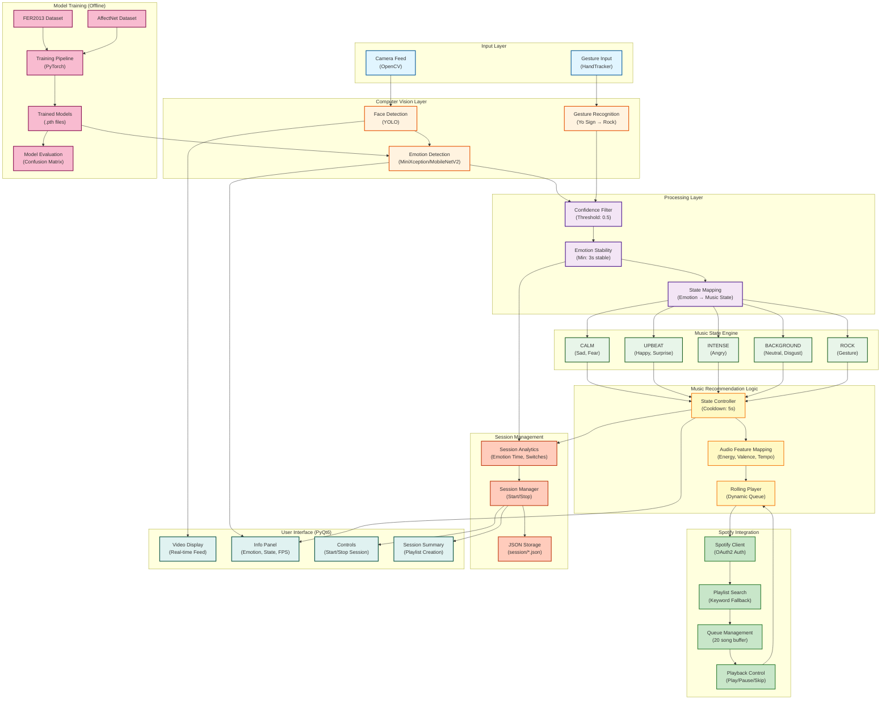
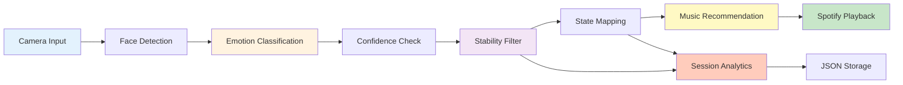
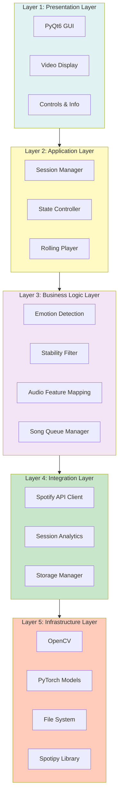
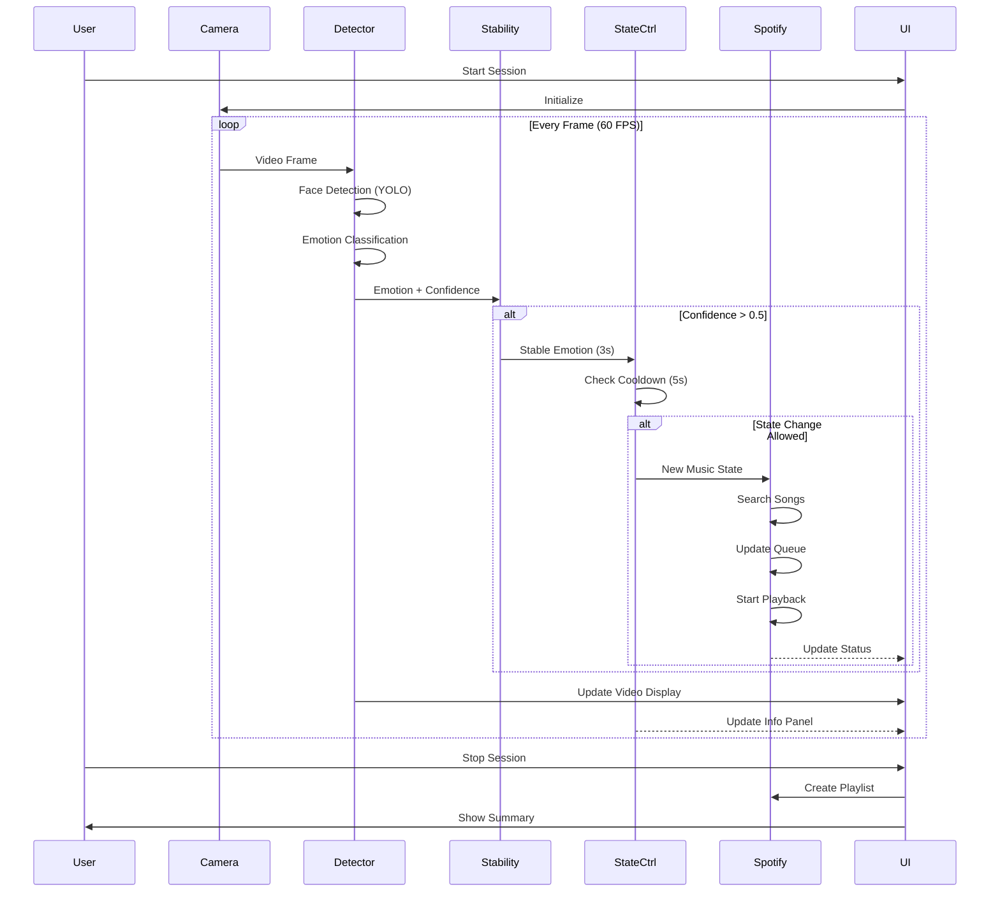
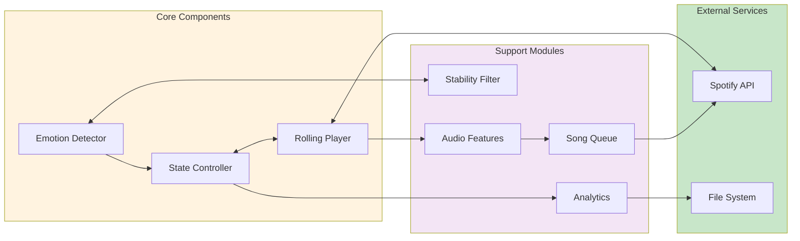
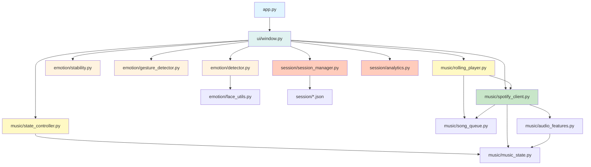
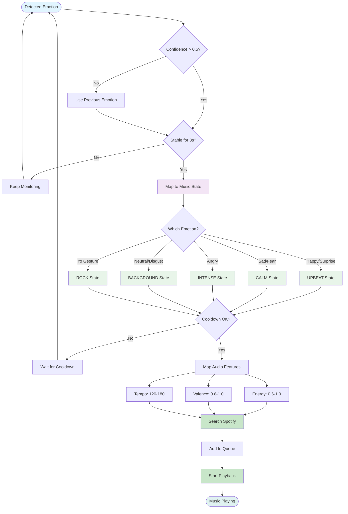

# System Architecture Documentation

## Overview

This document provides comprehensive architectural diagrams and explanations for the Emotion Driven Music Recommendation System.

---

## 1. Complete System Architecture Diagram

---

## 2. Simplified Data Flow Diagram

---

## 3. Layered Architecture

---

## 4. Real-time Processing Pipeline

---

## 5. Component Interaction Diagram

---

## 6. Module Dependency Graph

---

## 7. Emotion to Music Mapping Flow

---

## Architecture Design Principles

### 1. **Modular Design**
- Each component (emotion, music, session, UI) is self-contained
- Clear interfaces between modules
- Easy to test and maintain

### 2. **Real-time Processing**
- 60 FPS camera processing
- Efficient emotion detection pipeline
- Asynchronous Spotify API calls

### 3. **Stability Mechanisms**
- Confidence threshold (0.5) to filter uncertain predictions
- Emotion stability timer (3 seconds) to avoid rapid switches
- State cooldown (5 seconds) to prevent music disruption

### 4. **Fault Tolerance**
- Fallback to keyword search if playlist fails
- Graceful handling of camera errors
- Session recovery and logging

### 5. **Extensibility**
- Support for multiple emotion detection models
- Pluggable music state mappings
- Configurable audio feature targets

---

## Technology Stack

| Layer | Technologies |
|-------|-------------|
| **Deep Learning** | PyTorch, MiniXception, MobileNetV2 |
| **Computer Vision** | OpenCV, YOLO, MediaPipe |
| **Music API** | Spotify Web API, Spotipy |
| **UI Framework** | PyQt6 |
| **Data Storage** | JSON (session logs) |
| **Authentication** | OAuth2 (Spotify) |
| **Language** | Python 3.x |

---

## System Requirements

### Hardware
- Webcam (720p or higher recommended)
- CPU: Dual-core 2.0 GHz minimum
- RAM: 4GB minimum (8GB recommended)
- Internet connection for Spotify API

### Software
- Python 3.8+
- Windows/Linux/macOS
- Spotify Premium account (for playback control)

---

## Performance Characteristics

| Metric | Value |
|--------|-------|
| **Emotion Detection Latency** | < 50ms per frame |
| **Processing Frame Rate** | 60 FPS |
| **Model Accuracy** | 74.71% (AffectNet validation) |
| **State Switch Latency** | 3-8 seconds (stability + cooldown) |
| **Queue Buffer Size** | 20 songs |
| **Session Storage** | JSON (avg 200KB per session) |

---

## Key Features

1. **Multi-modal Input**: Camera + gesture recognition
2. **Dual Model Support**: MiniXception (lightweight) and MobileNetV2 (accurate)
3. **Intelligent State Management**: Stability filtering and cooldown
4. **Audio Feature Matching**: Maps emotions to musical characteristics
5. **Session Analytics**: Tracks emotional patterns and transitions
6. **Dynamic Playlist Generation**: Creates personalized playlists from sessions
7. **Real-time Visualization**: Live emotion display and confidence scores

---

## Future Enhancement Opportunities

- Multi-user support with face recognition
- Cloud-based session synchronization
- Advanced music recommendation using collaborative filtering
- Integration with additional music streaming services
- Mobile application support
- Voice command integration
- Emotion trend prediction using LSTM/Transformer models
